# python

## warmup-1

Date: 3 oct 2024

1.[sleep_in](https://codingbat.com/prob/p173401)

>The parameter weekday is True if it is a weekday, and the parameter vacation is True if we are on vacation. We sleep in if it is not a weekday or we're on vacation. Return True if we sleep in.

**Test Cases**
-  sleep_in(False, False) → True 
- sleep_in(True, False) → False
- sleep_in(False, True) → True

**Code:**
```python
def sleep_in(weekday, vacation):
  if weekday == False or vacation == True:
    return True
  else:
    return False
```
**Flowchart:**
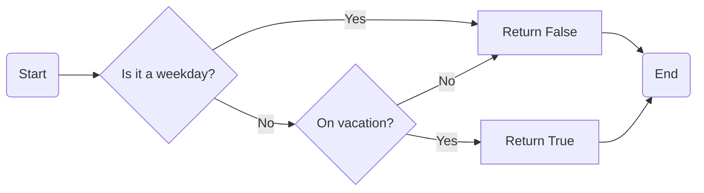

**Topics**

- conditional statements
- functions
- operators

**Output Screenshot:**

***
<br>
<br>
<br>
<br>
<br>
<br>
<br>
<br>
<br>
<br>
<br>
<br>
<br>
<br>
<br>
<br>
<br>
<br>
<br>
<br>
<br>
<br>
<br>
<br>
<br>
<br>
<br>
<br>
<br>
<br>
<br>

2.[monkey_trouble](https://codingbat.com/prob/p120546)

>We have two monkeys, a and b, and the parameters a_smile and b_smile indicate if each is smiling. We are in trouble if they are both smiling or if neither of them is smiling. Return True if we are in trouble.

**Test Cases**
- monkey_trouble(True, True) → True
- monkey_trouble(False, False) → True
- monkey_trouble(True, False) → False

**Code:**
```python
def monkey_trouble(a_smile, b_smile):
  if a_smile == True and b_smile == True or a_smile == False and b_smile == False:
    return True
  else:
    return False
```

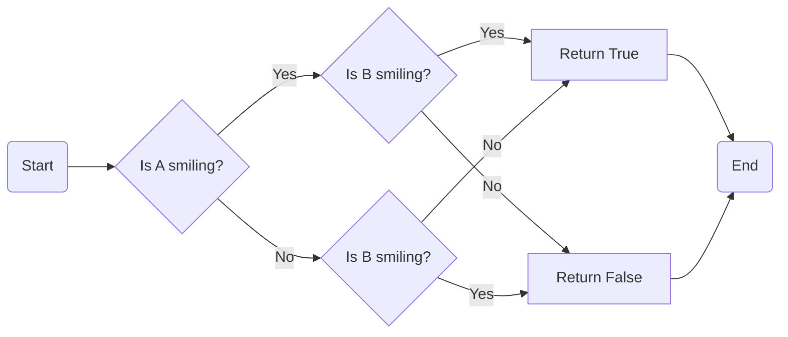
**Topics:**

- conditional statements
- functions
- operators

**Output Screenshot:**

*** 
<br>
<br> 
<br>
<br>
<br>
<br>
<br>
<br>
<br>
<br>
<br>
<br>
<br>
<br>
<br>
<br>
<br>
<br>
<br>
<br>
<br>
<br>
<br>
<br>
<br>
<br>
<br>
<br>

3.[sum_double](https://codingbat.com/prob/p141905)

>Given two int values, return their sum. Unless the two values are the same, then return double their sum.

**Test Cases**
- sum_double(1, 2) → 3
- sum_double(3, 2) → 5
- sum_double(2, 2) → 8

**Code:**
```python
def sum_double(a, b):
  if a == b:
    return (2*(a+b))
  else:
    return (a+b)
```
**flowchart:**
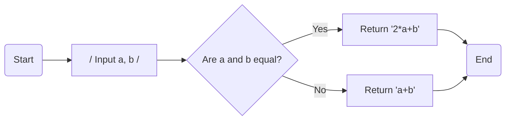
**Topics:**
- conditional statements
- functions
- operators

**Output Screenshot:**

***
<br>
<br>
<br>
<br>
<br>
<br> 
<br>
<br>
<br>
<br>
<br>
<br>
<br>
<br>
<br>
<br>
<br>
<br>
<br>
<br>
<br>
<br>
<br>
<br>
<br>
<br>
<br>

4.[diff21](https://codingbat.com/prob/p197466)

>Given an int n, return the absolute difference between n and 21, except return double the absolute difference if n is over 21.

**Test cases**
- diff21(19) → 2
- diff21(10) → 11
- diff21(21) → 0

**Code:**
```python
def diff21(n):
  if n <= 21:
    return (21 -n)
  else:
    return 2*(n-21)
```
**flowchart:**
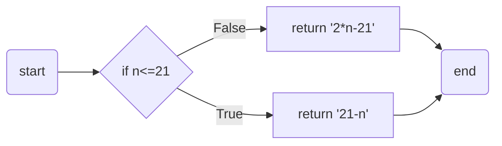
**Topics:**

-  conditional statements
- functions

**Output Screenshot:**

***
<br>
<br>
<br>
<br>
<br>
<br> 
<br>
<br>
<br>
<br>
<br>
<br>
<br>
<br>
<br>
<br>
<br>
<br>
<br>
<br>
<br>
<br>
<br>
<br>
<br>
<br>

5.[parrot_trouble](https://codingbat.com/prob/p166884)

>We have a loud talking parrot. The "hour" parameter is the current hour time in the range 0..23. We are in trouble if the parrot is talking and the hour is before 7 or after 20. Return True if we are in trouble.

**Test cases:**
- parrot_trouble(True, 6) → True
- parrot_trouble(True, 7) → False
- parrot_trouble(False, 6) → False

**Code:**
```python
def parrot_trouble(talking, hour):
  return (talking and (hour < 7 or hour > 20))
```
**flowchart:**
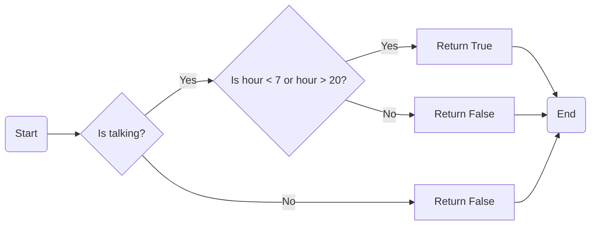
**Topics:**

- conditional statements
- functions
- operators

**Output Screenshot:**

***
<br>
<br>
<br>
<br>
<br>
<br>
<br>
<br> 
<br>
<br>
<br>
<br>
<br>
<br>
<br>
<br>
<br>
<br>
<br>
<br>
<br>
<br>
<br>
<br>
<br>
<br>

6.[makes10](https://codingbat.com/prob/p124984)

>Given 2 ints, a and b, return True if one if them is 10 or if their sum is 10.

**Test cases:**
- makes10(9, 10) → True
- makes10(9, 9) → False
- makes10(1, 9) → True

**Code:**
```python
def makes10(a, b):
  if a+b == 10 or b == 10 or a == 10:
    return True
  else:
    return False
```
**flowchart:**
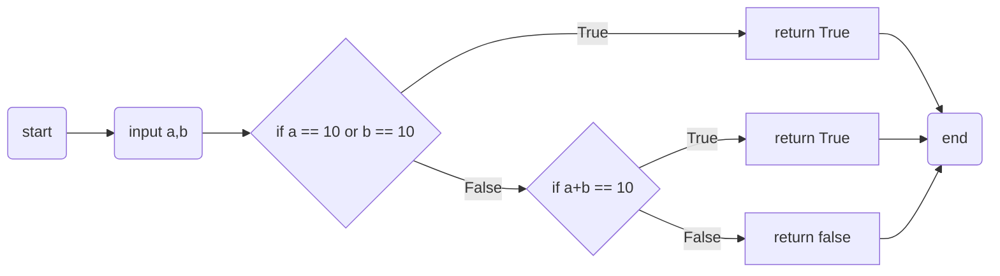
**Topics:**

- conditional statements
- functions
- operators

>**Output Screenshot:**

***
<br>
<br>
<br>
<br>
<br>
<br>
<br> 
<br>
<br>
<br>
<br>
<br>
<br>
<br>
<br>
<br>
<br>
<br>
<br>
<br>
<br>
<br>
<br>
<br>
<br>
<br>
<br>

7.[near_hundred](https://codingbat.com/prob/p124676)

>Given an int n, return True if it is within 10 of 100 or 200. Note: abs(num) computes the absolute value of a number.
**Test cases:**
- near_hundred(93) → True
- near_hundred(90) → True
- near_hundred(89) → False
**Code:**
```python
def near_hundred(n):
  if abs(100 - n) <= 10 or abs(200 - n) <= 10:
    return True
  else:
    return False
```
**flowchart:**
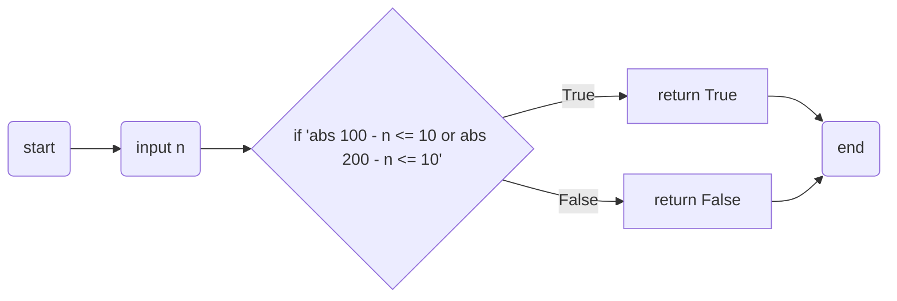
**Topics:**
- conditional statements
- functions
- oprerators
>**Output Screenshot:**

***
<br>
<br>
<br> 
<br>
<br>
<br>
<br>
<br>
<br>
<br>
<br>
<br>
<br>
<br>
<br>
<br>
<br>
<br>
<br>
<br>
<br>

8.[pos_neg](https://codingbat.com/prob/p162058)

>Given 2 int values, return True if one is negative and one is positive. Except if the parameter "negative" is True, then return True only if both are negative.

**Test cases:**
- pos_neg(1, -1, False) → True
- pos_neg(-1, 1, False) → True
- pos_neg(-4, -5, True) → True

**Code:**
```python
def pos_neg(a, b, negative):
    if negative:
        return a < 0 and b < 0 
    else:
        return (a < 0 and b > 0) or (a > 0 and b < 0)  
```
**flowchart:**
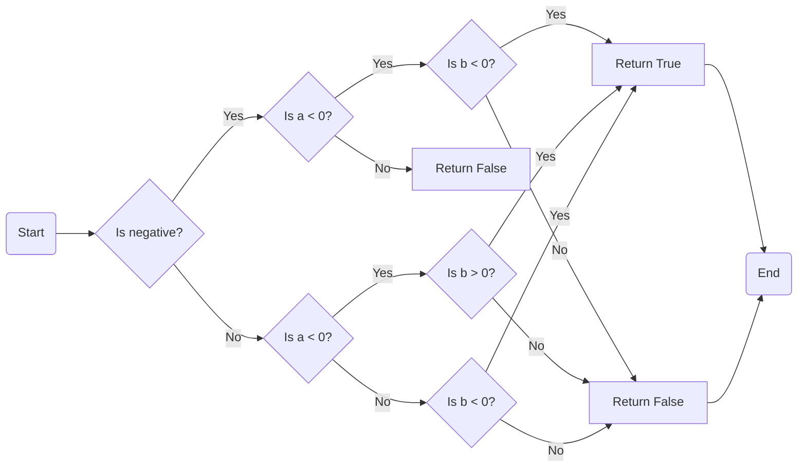

**topics:**
- conditional statements
- operators
  
**Output Screenshot:**

***
<br>
<br>
<br>
<br>
<br> 
<br>
<br>
<br>
<br>
<br>
<br>
<br>
<br>
<br>
<br>
<br>
<br>
<br>
<br>
<br>
<br>
<br>
<br>
<br>
<br>
<br>

9.[not_string](https://codingbat.com/prob/p189441)

>Given a string, return a new string where "not " has been added to the front. However, if the string already begins with "not", return the string unchanged.

**Test cases:**
- not_string('candy') → 'not candy'
- not_string('x') → 'not x'
- not_string('not bad') → 'not bad'

**Code:**
```python
def not_string(str):
  if len(str) >= 3 and str[:3] == "not":
    return str
  else:
    return "not " +  str
```
**flowchart:**
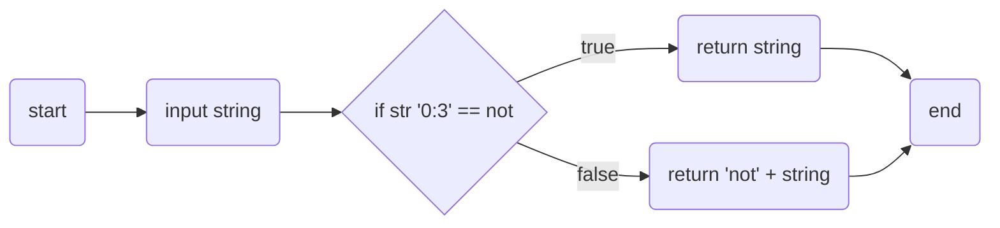
**topics:**
- conditional statements
- operators
- strings
  
**Output Screenshot:**

***
<br>
<br>
<br>
<br>
<br>
<br>
<br> 
<br>
<br>
<br>
<br>
<br>
<br>
<br>
<br>
<br>
<br>
<br>
<br>
<br>
<br>
<br>
<br>
<br>
<br>
<br>
<br>
<br>
<br>

10.[missing_char](https://codingbat.com/prob/p149524)

>Given a non-empty string and an int n, return a new string where the char at index n has been removed. The value of n will be a valid index of a char in the original string (i.e. n will be in the range 0..len(str)-1 inclusive).

**Test cases:**
- missing_char('kitten', 1) → 'ktten'
- missing_char('kitten', 0) → 'itten'
- missing_char('kitten', 4) → 'kittn'

**Code:**
```python
def missing_char(str, n):
  a =  str[:n]
  b = str[n+1:]
  return a + b
```
**flowchart:**
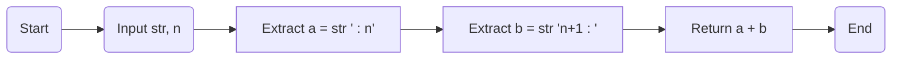
**topics:**
- conditional statements
- operators
- strings
  
**Output Screenshot:**

***
<br>
<br>
<br>
<br>
<br>
<br> 
<br>
<br>
<br>
<br>
<br>
<br>
<br>
<br>
<br>
<br>
<br>
<br>
<br>
<br>
<br>
<br>
<br>
<br>
<br>
<br>
<br>

11.[front_back](https://codingbat.com/prob/p153599)

>Given a string, return a new string where the first and last chars have been exchanged.

**Test cases:**
- front_back('code') → 'eodc'
- front_back('a') → 'a' 
- front_back('ab') → 'ba'

**Code:**
```python
def front_back(str):
  if len(str) <= 1:
    return str
  mid = str[1:-1]
  return str[-1] + mid + str[0]
```
**flowchart:**
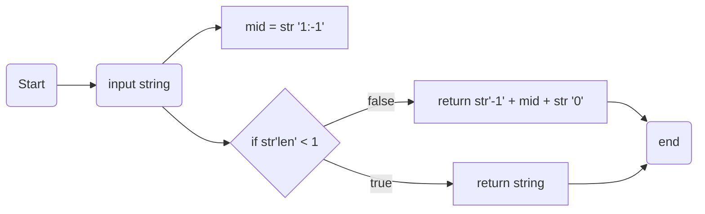
**topics:**
- conditional statements
- operators
- strings
  
**Output Screenshot:**

***
<br>
<br>
<br>
<br>
<br>
<br>
<br>
<br>
<br> 
<br>
<br>
<br>
<br>
<br>
<br>
<br>
<br>
<br>
<br>
<br>
<br>
<br>
<br>
<br>
<br>
<br>
<br>
<br>
<br>

12.[front3](https://codingbat.com/prob/p147920)

>Given a string, we'll say that the front is the first 3 chars of the string. If the string length is less than 3, the front is whatever is there. Return a new string which is 3 copies of the front.

**Test cases:**
- front3('Java') → 'JavJavJav'
- front3('Chocolate') → 'ChoChoCho'
- front3('abc') → 'abcabcabc'

**Code:**
```python
def front3(str):
  if len(str) <= 3:
    return 3 * str
  else:
    return 3 * str[0:3]
```
**flowchart:**
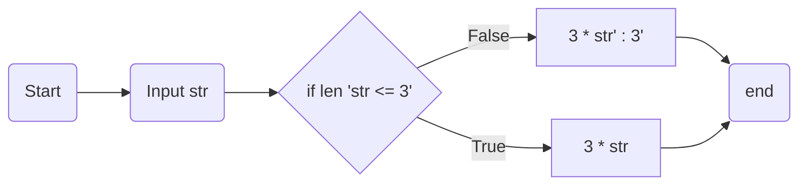
**topics:**
- conditional statements
- operators
- strings
  
**Output Screenshot:**

***

<br>
<br>
<br>
<br>
<br>
<br>
<br>
<br> 
<br>
<br>
<br>
<br>
<br>
<br>
<br>
<br>
<br>
<br>
<br>
<br>
<br>
<br>
<br>
<br>
<br>
<br>
<br>
<br>
<br>
<br>

## warmup-2

1.[string_times](https://codingbat.com/prob/p193507)

>Given a string and a non-negative int n, return a larger string that is n copies of the original string.

**Test cases:**
- string_times('Hi', 2) → 'HiHi'
- string_times('Hi', 3) → 'HiHiHi'
- string_times('Hi', 1) → 'Hi'
  
**code:**
```python
def string_times(str, n):
    return n * str
```
**Flowchart:**
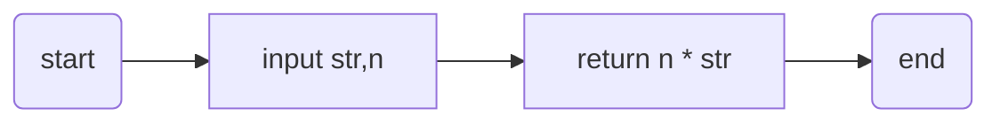
**topics:**
- string slicing
- functions

**output screenshot:**

***

2.[front_times](https://codingbat.com/prob/p165097)

>Given a string and a non-negative int n, we'll say that the front of the string is the first 3 chars, or whatever is there if the string is less than length 3. Return n copies of the front;

**test cases:**
- front_times('Chocolate', 2) → 'ChoCho'
- front_times('Chocolate', 3) → 'ChoChoCho'
- front_times('Abc', 3) → 'AbcAbcAbc'

**code:**
```python
def front_times(str, n):
  if len(str) <= 3:
    return n * str
  else:
    return n * str[0:3]
```
**Flowchart:**
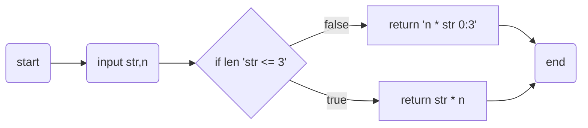
**topics:**
- strings
- functions

**output screenshot:**

***
<br>
<br>
<br>
<br>
<br>
<br>
<br>
<br>
<br>
<br>
<br>
<br>
<br>
<br>
<br>
<br>
<br>
<br>
<br>
<br>
<br>
<br>
<br>
<br>
<br>
<br>
<br>
<br>
<br>
<br>

3.[string_bits](https://codingbat.com/prob/p113152)

>Given a string, return a new string made of every other char starting with the first, so "Hello" yields "Hlo".

**test cases:**
- string_bits('Hello') → 'Hlo'
- string_bits('Hi') → 'H'
- string_bits('Heeololeo') → 'Hello'

**code:**
```python
def string_bits(str):
  result = ""
  for i in range (len(str)):
    if i % 2 == 0:
      result = result + str[i]
  return result
```
**flowchart:**
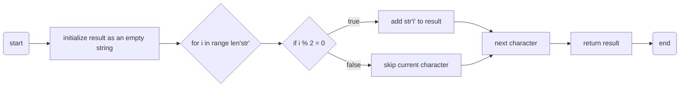
**topics:**
- loops
- operators
- conditional statements
- functions and strings

**output screenshot:**
***

<br>
<br>
<br>
<br> 
<br>
<br>
<br>
<br>
<br>
<br>
<br>
<br>
<br>
<br>
<br>
<br>
<br>
<br>
<br>
<br>
<br>
<br>
<br>
<br>
<br>
<br>
<br>

4.[string_splosion](https://codingbat.com/prob/p118366)

>Given a non-empty string like "Code" return a string like "CCoCodCode".

**test cases:**
- string_splosion('Code') → 'CCoCodCode'
- string_splosion('abc') → 'aababc'
- string_splosion('ab') → 'aab'

**code:**
```python
def string_splosion(str):
  result = ""
  for i in range(len(str)):
    result = result + str[:i+1]
  return result
```
**Flowchart:**
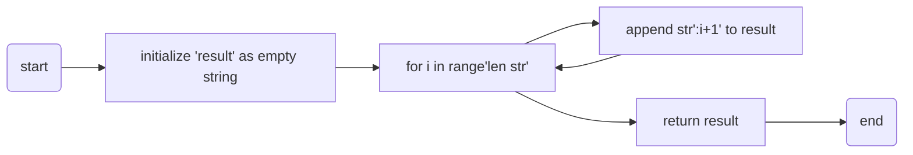
**topics:**
- loops
- operators
- conditional statements
- functions and strings

**output screenshot:**

***

<br>
<br>
<br>
<br>
<br>
<br> 
<br>
<br>
<br>
<br>
<br>
<br>
<br>
<br>
<br>
<br>
<br>
<br>
<br>
<br>
<br>
<br>
<br>
<br>
<br>
<br>
<br>
<br>

5.[last2](https://codingbat.com/prob/p145834)
>Given a string, return the count of the number of times that a substring length 2 appears in the string and also as the last 2 chars of the string, so "hixxxhi" yields 1 (we won't count the end substring).

**Test cases:**
- last2('hixxhi') → 1
- last2('xaxxaxaxx') → 1
- last2('axxxaaxx') → 2

**code:**
```python
def  last2(str):
  if len(str) < 2:
    return 0
  last2 = str[-2:]
  count = 0
  for i in range(len(str[:-2])):
    sub = str[i:i+2]
    if sub == last2:
      count = count + 1
  return count
``` 
**flowchart:**
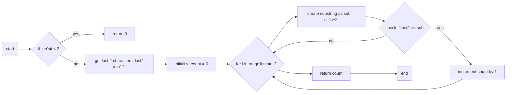
**topics:**
- strings 
- conditional statements 
- loops & functions

**output screenshot:**

***
<br>
<br> 
<br>
<br>
<br>
<br>
<br>
<br>
<br>
<br>
<br>
<br>
<br>
<br>
<br>
<br>
<br>
<br>
<br>
<br>
<br>
<br>
<br>
<br>

6.[array_count9](https://codingbat.com/prob/p166170)

>Given an array of ints, return the number of 9's in the array.

**Test cases:**
- array_count9([1, 2, 9]) → 1
- array_count9([1, 9, 9]) → 2
- array_count9([1, 9, 9, 3, 9]) → 3

**code:**
```python
def array_count9(nums):
  if len(nums) < 1:
    return 0
  count = 0
  for i in range(len(nums[0:])):
    if nums[i] == 9:
      count = count + 1
  return count
```
**flowchart:**
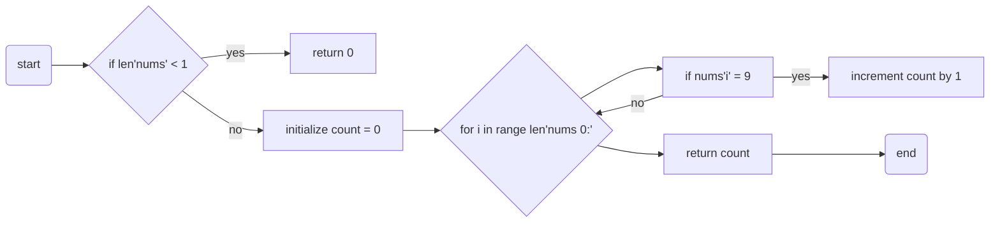
**topics:**
- conditional statements
- loops & functions
- strings

**output screenshot:**

***
<br>
<br>
<br>
<br>
<br>
<br> 
<br>
<br>
<br>
<br>
<br>
<br>
<br>
<br>
<br>
<br>
<br>
<br>
<br>
<br>
<br>
<br>
<br>
<br>
<br>
<br>
<br>
<br>
<br>

7.[array_front9](https://codingbat.com/prob/p110166)

>Given an array of ints, return True if one of the first 4 elements in the array is a 9. The array length may be less than 4.

**Test cases:**
- array_front9([1, 2, 9, 3, 4]) → True
- array_front9([1, 2, 3, 4, 9]) → False
- array_front9([1, 2, 3, 4, 5]) → False

**code:**
```python
def array_front9(nums):
  if len(nums) == 0:
    return False
  for i in range(len(nums[0:4])):
    if nums[i] == 9:
      return True
  return False
``` 
**flowchart:**
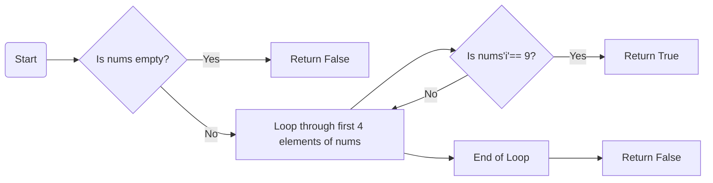

**topics:**
- loops
- strings
- conditional statements

**output screenshot:**

***
<br>
<br>
<br> 
<br>
<br>
<br>
<br>
<br>
<br>
<br>
<br>
<br>
<br>
<br>
<br>
<br>
<br>
<br>
<br>
<br>
<br>
<br> 
<br>
<br>
<br>

8.[array123](https://codingbat.com/prob/p193604)

>Given an array of ints, return True if the sequence of numbers 1, 2, 3 appears in the array somewhere.

**Test cases:**
- array123([1, 1, 2, 3, 1]) → True
- array123([1, 1, 2, 4, 1]) → False
- array123([1, 1, 2, 1, 2, 3]) → True

**code:**
```python
def array123(nums):
  for i in range(len(nums[:-2])):
    if nums[i] == 1 and nums[i+1] == 2 and nums[i+2] == 3:
      return True
  return False
```
**Flowchart:**
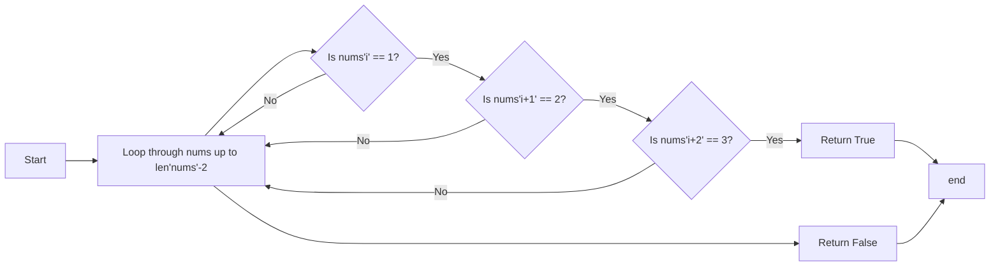
**topics:**
- loops
- conditional statements
- operators and strings
  
**output screenshot:**

***
<br>
<br>
<br>
<br>
<br> 
<br>
<br>
<br>
<br>
<br>
<br>
<br>
<br>
<br>
<br>
<br>
<br>
<br>
<br>
<br>
<br>
<br>
<br>
<br>
<br>
<br>

9.[string_match](https://codingbat.com/prob/p182414)

>Given 2 strings, a and b, return the number of the positions where they contain the same length 2 substring. So "xxcaazz" and "xxbaaz" yields 3, since the "xx", "aa", and "az" substrings appear in the same place in both strings.

**Test cases:**
- string_match('xxcaazz', 'xxbaaz') → 3
- string_match('abc', 'abc') → 2
- string_match('abc', 'axc') → 0
  
**code:**
```python
def string_match(a, b):
  shorter = min(len(a), len(b))
  count = 0
  for i in range(shorter-1):
    a_sub = a[i:i+2]
    b_sub = b[i:i+2]
    if a_sub == b_sub:
      count = count + 1
  return count
```
**flowchart:** 
```mermaid
flowchart LR
    A[Start] --> B[Find the length of the shorter string 'min len a, len b']
    B --> C[Initialize count = 0]
    C --> D[Loop through range 0 to shorter-2]
    D --> E[a_sub = a'i:i+2']
    E --> F[b_sub = b'i:i+2']
    F --> G{Is a_sub == b_sub?}
    G -- Yes --> H[Increment count by 1]
    G -- No --> D
    H --> D
    D --> I[End of Loop]
    I --> J[Return count]

```

**topics:**
- strings
- functions and loops
- conditional statements

**Output screenshot:**

***
<br>
<br> 
<br>
<br>
<br>
<br>
<br>
<br>
<br>
<br>
<br>
<br>
<br>
<br>
<br>
<br>
<br>
<br>
<br>
<br>
<br>
<br>
<br>
<br>
<br>
<br>
<br>

## warmup-3              

1.[hello_name](https://codingbat.com/prob/p115413)

>Given a string name, e.g. "Bob", return a greeting of the form "Hello Bob!".

**Test cases:**
- hello_name('Bob') → 'Hello Bob!'
- hello_name('Alice') → 'Hello Alice!'
- hello_name('X') → 'Hello X!'
  
**code:**
```python
def hello_name(name):
  return 'Hello ' + name +'!'
```
**flowchart:**
```mermaid
flowchart LR
    A[Start]
    B[Return "Hello " + name + "!"]
    A --> B
``` 
**topics:**
- strings
- operators

**Output screenshot:**

***

2.[make_abba](https://codingbat.com/prob/p182144)

>Given two strings, a and b, return the result of putting them together in the order abba, e.g. "Hi" and "Bye" returns "HiByeByeHi".

**Test cases:**
- make_abba('Hi', 'Bye') → 'HiByeByeHi'
- make_abba('Yo', 'Alice') → 'YoAliceAliceYo'
- make_abba('What', 'Up') → 'WhatUpUpWhat'
  
**code:**
```python
def make_abba(a, b):
  return a + b + b + a
```
**Flowchart:**
```mermaid
    C[Start]
    D[Return a + b + b + a]
    C --> D
```
**Topics:**
- operators 
- functions

**Output screenshot:**

***
<br>

3.[make_tags](https://codingbat.com/prob/p132290)

>The web is built with HTML strings like "<i>Yay</i>" which draws Yay as italic text. In this example, the "i" tag makes <i> and </i> which surround the word "Yay". Given tag and word strings, create the HTML string with tags around the word, e.g. "<i>Yay</i>".

**Test cases:**
- make_tags('i', 'Yay') → '<i>Yay</i>'
- make_tags('i', 'Hello') → '<i>Hello</i>'
- make_tags('cite', 'Yay') → '<cite>Yay</cite>'
  
**code:**
```python
def make_tags(tag, word):
  return '<'+ tag + '>' + word + '</' + tag + '>'
```
**Flowchart:**
```mermaid
    E[Start]
    F[Return "<" + tag + ">" + word + "</" + tag + ">"]
    E --> F
```
**topics:**
- strings 
- operators

**Output screenshot:**

***

4.[make_out_word](https://codingbat.com/prob/p129981)

>Given an "out" string length 4, such as "<<>>", and a word, return a new string where the word is in the middle of the out string.

**Test cases:**
- make_out_word('<<>>', 'Yay') → '<<Yay>>'
- make_out_word('<<>>', 'WooHoo') → '<<WooHoo>>'
- make_out_word('[[]]', 'word') → '[[word]]'

**code:**
```python
def make_out_word(out, word):
  return out[:2] + word + out[2:]
```
**Flowchart:**
```mermaid
    G[Start]
    H[Return out[:2] + word + out[2:]]
    G --> H
```
**Topics:**
- strings  
- operators

**Output sccreenshot:**

***

<br>
<br>
<br>

5.[extra_end](https://codingbat.com/prob/p148853)

>Given a string, return a new string made of 3 copies of the last 2 chars of the original string. The string length will be at least 2.

**Test cases:**
- extra_end('Hello') → 'lololo'
- extra_end('ab') → 'ababab'
- extra_end('Hi') → 'HiHiHi'

**code:**
```python
def extra_end(str):
  return str[-2:] * 3
```
**Flowchart:**
```mermaid
    I[Start]
    J[Return str[-2:] * 3]
    I --> J
```
**Topics:**
- strings 
- operators
  
**Output screenshot:**

***

<br>
<br>
<br>

6.[first_two](https://codingbat.com/prob/p184816)

>Given a string, return the string made of its first two chars, so the String "Hello" yields "He". If the string is shorter than length 2, return whatever there is, so "X" yields "X", and the empty string "" yields the empty string "".

**Test cases:**
- first_two('Hello') → 'He'
- first_two('abcdefg') → 'ab'
- first_two('ab') → 'ab'

**code:**
```python
def first_two(str):
  return str[0:2]
```
**Flowchart:**
```mermaid
    K[Start]
    L[Return str[0:2]]
    K --> L
```
**Topics:**
- strings
  
**Output screenshot:**

***

7.[first_half](https://codingbat.com/prob/p107010)

>Given a string of even length, return the first half. So the string "WooHoo" yields "Woo".

**Test cases:**
- first_half('WooHoo') → 'Woo'
- first_half('HelloThere') → 'Hello'
- first_half('abcdef') → 'abc'

**code:**
```python
def first_half(str):
  i = len(str) // 2
  return str[:i]
```
**Flowchart:**
```mermaid
    M[Start]
    N[Calculate length of str // 2]
    O[Return str[:i]]
    M --> N
    N --> O
```
**Topics:**
- strings 
- operators
  
**Output screenshot:**

***

8.[without_end](https://codingbat.com/prob/p138533)

>Given a string, return a version without the first and last char, so "Hello" yields "ell". The string length will be at least 2.

**Test cases:**
- without_end('Hello') → 'ell'
- without_end('java') → 'av'
- without_end('coding') → 'odin'

**code:**
```python
def without_end(str):
  return str[1:-1]
```
**Flowchart:**
```mermaid
    P[Start]
    Q[Return str[1:-1]]
    P --> Q
```
**Topics:**
- strings
  
**Output screenshot:**

***
<br>

9.[combo_string](https://codingbat.com/prob/p194053)

>Given 2 strings, a and b, return a string of the form short+long+short, with the shorter string on the outside and the longer string on the inside. The strings will not be the same length, but they may be empty (length 0).

**Test cases:**
- combo_string('Hello', 'hi') → 'hiHellohi'
- combo_string('hi', 'Hello') → 'hiHellohi'
- combo_string('aaa', 'b') → 'baaab'

**code:**
```python
def combo_string(a, b):
  lenA = len(a)
  lenB = len(b)
  if lenA > lenB:
    return b + a + b
  else:
    return a + b + a
```

**Flowchart:**
```mermaid
flowchart LR
    R[Start]
    S[Calculate length of a]
    T[Calculate length of b]
    U[If lenA > lenB, Return b + a + b]
    V[Else, Return a + b + a]
    R --> S
    S --> T
    T --> U
    T --> V
```

**Topics:**
- strings 
- operators
  
**Output screenshot:**

***

<br>
<br>
<br> 
<br>
<br>
<br>
<br>
<br>
<br>
<br>
<br>
<br>
<br>
<br>
<br>
<br>
<br>
<br>
<br>
<br>
<br>
<br>
<br>
<br>
<br>

10.[non_start](https://codingbat.com/prob/p127703)

>Given 2 strings, return their concatenation, except omit the first char of each. The strings will be at least length 1.

**Test cases:**
- non_start('Hello', 'There') → 'ellohere'
- non_start('java', 'code') → 'avaode'
- non_start('shotl', 'java') → 'hotlava'
  
**code:**
```python
def non_start(a, b):
  return a[1:] + b[1:]
```
**Flowchart:**
```mermaid
    W[Start]
    X[Return a[1:] + b[1:]]
    W --> X
```
**Topics:**
- strings 
- operators

**Output screenshot:**

***

<br>
<br>
<br>
<br>
<br>
<br>
<br>

11.[left2](https://codingbat.com/prob/p160545)

>Given a string, return a "rotated left 2" version where the first 2 chars are moved to the end. The string length will be at least 2.

**Test cases:**
- left2('Hello') → 'lloHe'
- left2('java') → 'vaja'
- left2('Hi') → 'Hi'

**code:**
```python
def left2(str):
  return str[2:] + str[:2]
```
**Flowchart:**
```mermaid
flowchart LR
    Y[Start] --> Z[Return str'2:' + st':2']
```
**Topics:**
- strings  
- operators

**Output screenshot:**

***

<br>
<br>
<br>
<br>
<br>
<br>
<br>

## warmup-4

1.[first_last6](https://codingbat.com/prob/p181624)

>Given an array of ints, return True if 6 appears as either the first or last element in the array. The array will be length 1 or more.

**Test cases:**
- first_last6([1, 2, 6]) → True
- first_last6([6, 1, 2, 3]) → True
- first_last6([13, 6, 1, 2, 3]) → False
  
**code:**
```python
def first_last6(nums):
  if nums[0] == 6 or nums[-1] == 6:
    return True
  else:
    return False
```
**Flowchart:**
```mermaid
flowchart LR 
    A[Start]
    B[Check if nums'0' == 6 or nums'-1' == 6]
    C[Return True if condition is met, else False]
    A --> B
    B --> C
```
**Topics:**
- conditional statements

**Output screenshot:**


2.[same_first_last](https://codingbat.com/prob/p179078)

>Given an array of ints, return True if the array is length 1 or more, and the first element and the last element are equal.

**Test cases:**
- same_first_last([1, 2, 3]) → False
- same_first_last([1, 2, 3, 1]) → True
- same_first_last([1, 2, 1]) → True

**code:**
```python
def same_first_last(nums):
  return (len(nums) >= 1 and nums[0] == nums[-1])
```
**Flowchart:**
```mermaid
flowchart LR 
    D[Start]
    E[Check if len'nums' >= 1 and nums'0' == nums'-1']
    F[Return result]
    D --> E
    E --> F
```
**Topics:**
- operators

**Output screenshot:**

***

<br>
<br>
<br>
<br>
<br>
<br>
<br>

3.[make_pi](https://codingbat.com/prob/p113659)

>Given a string, return a "rotated left 2" version where the first 2 chars are moved to the end. The string length will be at least 2.

**Test cases:**
- left2('Hello') → 'lloHe'
- left2('java') → 'vaja'
- left2('Hi') → 'Hi'

**code:**
```python
def left2(str):
  return str[2:] + str[:2]
```
**Flowchart:**
```mermaid
flowchart LR 
    G[Start]
    H[Return str'2:' + str':2']
    G --> H
```

**Topics:**
- strings & operators

**Output screenshot:**

***

<br>
<br>
<br>
<br>
<br>
<br>
<br>
<br>
<br>
<br>
<br>
<br>
<br>
<br>

4.[common_end](https://codingbat.com/prob/p147755)

>Given 2 arrays of ints, a and b, return True if they have the same first element or they have the same last element. Both arrays will be length 1 or more.

**Test cases:**
- common_end([1, 2, 3], [7, 3]) → True
- common_end([1, 2, 3], [7, 3, 2]) → False
- common_end([1, 2, 3], [1, 3]) → True

**code:**
```python
def common_end(a, b):
  return (a[0] == b[0] or a[-1] == b[-1])
```
**Flowchart:**
```mermaid
flowchart LR 
    I[Start]
    J[Check if a'0' == b'0' or a'-1' == b'-1']
    K[Return result]
    I --> J
    J --> K
```
**Topics:**
- operators

**Output screenshot:**

***

<br>
<br>
<br>
<br>
<br>
<br>
<br>
<br>
<br>
<br>

5.[sum3](https://codingbat.com/prob/p191645)

>Given an array of ints length 3, return the sum of all the elements.

**Test cases:**
- sum3([1, 2, 3]) → 6
- sum3([5, 11, 2]) → 18
- sum3([7, 0, 0]) → 7

**code:**
```python
def sum3(nums):
  return nums[0] + nums[1] + nums[2]
```
**Flowchart:**
```mermaid
flowchart LR 
    L[Start]
    M[Return sum of nums'0', nums'1', and nums'2']
    L --> M
```
**Topics:**
- operators

**Output screenshot:**

***

<br>
<br>
<br>
<br>
<br>
<br>
<br>
<br>
<br>

6.[rotate_left3](https://codingbat.com/prob/p148661)

>Given an array of ints length 3, return an array with the elements "rotated left" so {1, 2, 3} yields {2, 3, 1}.

**Test cases:**
- rotate_left3([1, 2, 3]) → [2, 3, 1]
- rotate_left3([5, 11, 9]) → [11, 9, 5]
- rotate_left3([7, 0, 0]) → [0, 0, 7]

**code:**
```python
def rotate_left3(nums):
  return [nums[1], nums [2], nums[0]]
```
**Flowchart:**
```mermaid
flowchart LR 
    N[Start]
    O[Return [nums'1', nums'2', nums'0']
    N --> O
```
**Topics:**
- lists

**Output screenshot:**

***

<br>
<br>
<br>
<br>
<br>
<br>
<br>
<br>
<br>
<br>

7.[reverse3](https://codingbat.com/prob/p192962)

>Given an array of ints length 3, return a new array with the elements in reverse order, so {1, 2, 3} becomes {3, 2, 1}.

**Test cases:**
- reverse3([1, 2, 3]) → [3, 2, 1]
- reverse3([5, 11, 9]) → [9, 11, 5]
- reverse3([7, 0, 0]) → [0, 0, 7]

**code:**
```python
def reverse3(nums):
  return [nums[2], nums[1], nums[0]]
```
**Flowchart:**
```mermaid
flowchart LR 
    P[Start]
    Q[Return [nums'2', nums'1', nums'0']
    P --> Q
```
**Topics:**
- Lists

**Output screenshot:**

***

<br>
<br>
<br>
<br>
<br>
<br>
<br>

8.[max_end3](https://codingbat.com/prob/p135290)

>Given an array of ints length 3, figure out which is larger, the first or last element in the array, and set all the other elements to be that value. Return the changed array.

**Test cases:**
- max_end3([1, 2, 3]) → [3, 3, 3]
- max_end3([11, 5, 9]) → [11, 11, 11]
- max_end3([2, 11, 3]) → [3, 3, 3]

**code:**
```python
def max_end3(nums):
  if nums[0] > nums[2]:
    return [nums[0],nums[0],nums[0]]
  else:
    return [nums[2],nums[2],nums[2]]
```
**Flowchart:**
```mermaid
flowchart LR 
    R[Start]
    S[Check if nums'0' > nums'2']
    T[Return nums'0', nums'0',nums'0']
    U[Else, Return nums'2', nums'2', nums'2']
    R --> S
    S --> T
    S --> U
```
**Topics:**
- lists & operators

**Output screenshot:**

***

<br>
<br>
<br>
<br>
<br>
<br>

9.[sum2](https://codingbat.com/prob/p192589)

>Given an array of ints, return the sum of the first 2 elements in the array. If the array length is less than 2, just sum up the elements that exist, returning 0 if the array is length 0.

**Test cases:**
- sum2([1, 2, 3]) → 3
- sum2([1, 1]) → 2
- sum2([1, 1, 1, 1]) → 2

**code:**
```python
def sum2(nums):
  if len(nums) == 0:
    return 0
  elif len(nums) == 1:
    return nums[0]
  else:
    return nums[0] + nums[1]
```
**Flowchart:**
```mermaid
flowchart LR 
    V[Start]
    W[Check length of nums]
    X[Return sum based on conditions]
    V --> W
    W --> X
```
**Topics:**
- lists & operators
- conditional statements
  
**Output screenshot:**

***
<br>

10.[middle_way](https://codingbat.com/prob/p171011)

>Given 2 int arrays, a and b, each length 3, return a new array length 2 containing their middle elements.

**Test cases:**
- middle_way([1, 2, 3], [4, 5, 6]) → [2, 5]
- middle_way([7, 7, 7], [3, 8, 0]) → [7, 8]
- middle_way([5, 2, 9], [1, 4, 5]) → [2, 4]

**code:**
```python
def middle_way(a, b):
  return [a[1], b[1]]
```
**Flowchart:**
```mermaid
flowchart LR 
    Y[Start]
    Z[Return a'1', b'1']
    Y --> Z
```

**Topics:**
- lists

**Output screenshot:**

***

<br>
<br>
<br>
<br>
<br>
<br>
<br>
<br>
<br>
<br>

11.[make_ends](https://codingbat.com/prob/p124806)

>Given an array of ints, return a new array length 2 containing the first and last elements from the original array. The original array will be length 1 or more.

**Test cases:**
- make_ends([1, 2, 3]) → [1, 3]
- make_ends([1, 2, 3, 4]) → [1, 4]
- make_ends([7, 4, 6, 2]) → [7, 2]

**code:**
```python
def make_ends(nums):
  return [nums[0], nums[-1]]
```
**Flowchart:**
```mermaid
flowchart LR 
    AA[Start]
    AB[Return nums'0', nums'-1']
    AA --> AB
```
**Topics:**
- lists

**Output screenshot:**

***

<br>
<br>
<br>
<br>
<br>
<br>
<br>
<br>

12.[has23](https://codingbat.com/prob/p177892)

>Given an int array length 2, return True if it contains a 2 or a 3.

**Test cases:**
- has23([2, 5]) → True
- has23([4, 3]) → True
- has23([4, 5]) → False

**code:**
```python
def has23(nums):
  if nums[0] == 2 or nums[0] == 3 or nums[1] == 2 or nums[1] == 3:
    return True
  else:
    return False
```
**Flowchart:**
```mermaid
flowchart LR 
    AC[Start]
    AD[Check if nums'0' == 2 or nums'0' == 3 or nums'1' == 2 or nums'1' == 3]
    AE[Return True if condition is met, else False]
    AC --> AD
    AD --> AE
```
**Topics:**
- operators
- conditional statements
  
**Output screenshot:**

***
<br>
<br>
<br>

## warmup-5

1.[cigar_party](https://codingbat.com/prob/p195669)

>When squirrels get together for a party, they like to have cigars. A squirrel party is successful when the number of cigars is between 40 and 60, inclusive. Unless it is the weekend, in which case there is no upper bound on the number of cigars. Return True if the party with the given values is successful, or False otherwise.

**Test cases:**
- cigar_party(30, False) → False
- cigar_party(50, False) → True
- cigar_party(70, True) → True

**code:**
```python
def cigar_party(cigars, is_weekend):
  if is_weekend:
    return cigars >= 40 
  else:
    return cigars >= 40 and cigars <= 60
```
**Flowchart:**
```mermaid
flowchart LR 
    AF[Start]
    AG[Check if is_weekend]
    AH[Check if cigars >= 40]
    AI[Return result based on conditions]
    AF --> AG
    AG --> AH
    AH --> AI
```
**Topics:**
- conditional statements & operators
  
**Output screenshot:**
***

2.[date_fashion](https://codingbat.com/prob/p129125)
>You and your date are trying to get a table at a restaurant. The parameter "you" is the stylishness of your clothes, in the range 0..10, and "date" is the stylishness of your date's clothes. The result getting the table is encoded as an int value with 0=no, 1=maybe, 2=yes. If either of you is very stylish, 8 or more, then the result is 2 (yes). With the exception that if either of you has style of 2 or less, then the result is 0 (no). Otherwise the result is 1 (maybe).

**Test cases:**
- date_fashion(5, 10) → 2 - date_fashion(5, 2) → 0 - date_fashion(5, 5) → 1

**code:**
```python
def date_fashion(you, date):
  if you <= 2 or date <=2:
    return 0
  elif you >=8 or date >=8:
    return 2
  else:
    return 1
```
**Flowchart:**
```mermaid
flowchart LR 
    AJ[Start]
    AK[Check values of you and date]
    AL[Return 0, 1, or 2 based on conditions]
    AJ --> AK
    AK --> AL
```
**Topics:**
- conditional statements & operators

**Output screenshot:**
***
3.[squirrel_play](https://codingbat.com/prob/p135815)
>The squirrels in Palo Alto spend most of the day playing. In particular, they play if the temperature is between 60 and 90 (inclusive). Unless it is summer, then the upper limit is 100 instead of 90. Given an int temperature and a boolean is_summer, return True if the squirrels play and False otherwise.

**Test cases:**
- squirrel_play(70, False) → True
- squirrel_play(95, False) → False
- squirrel_play(95, True) → True
  
**code:**
```python
def squirrel_play(temp, is_summer):
  if is_summer:
    return (temp >= 60 and temp <= 100)
  else:
    return (temp >= 60 and temp <= 90)
```
**Flowchart:**
```mermaid
flowchart LR 
    AM[Start]
    AN[Check if is_summer]
    AO[Check if temp is within range based on is_summer]
    AP[Return result]
    AM --> AN
    AN --> AO
    AO --> AP
```
**Topics:**
- conditional statements
- operators

**Output screenshot:**

***

4.[caught_speeding](https://codingbat.com/prob/p137202)
>You are driving a little too fast, and a police officer stops you. Write code to compute the result, encoded as an int value: 0=no ticket, 1=small ticket, 2=big ticket. If speed is 60 or less, the result is 0. If speed is between 61 and 80 inclusive, the result is 1. If speed is 81 or more, the result is 2. Unless it is your birthday -- on that day, your speed can be 5 higher in all cases.

**Test cases:**
- caught_speeding(60, False) → 0 - caught_speeding(65, False) → 1 - caught_speeding(65, True) → 0

**code:**
```python
def caught_speeding(speed, is_birthday):
  if is_birthday:
    speed -= 5
  if speed <= 60:
    return 0
  elif speed > 80:
    return 2
  else:
    return 1
```
**Flowchart:**
```mermaid
flowchart LR 
    AQ[Start]
    AR[Check if is_birthday]
    AS[Adjust speed if birthday]
    AT[Check if speed <= 60, > 80, or between]
    AU[Return appropriate result]
    AQ --> AR
    AR --> AS
    AS --> AT
    AT --> AU
```
**Topics:**
- conditional statements & operators

**Output screenshot:**
***

5.[sorta_sum](https://codingbat.com/prob/p116620)
>Given 2 ints, a and b, return their sum. However, sums in the range 10..19 inclusive, are forbidden, so in that case just return 20.

**Test cases:**
sorta_sum(3, 4) → 7
sorta_sum(9, 4) → 20
sorta_sum(10, 11) → 21

**code:**
```python
def sorta_sum(a, b):
  if 10 <= a + b < 20:
    return 20
  else:
    return a + b
```
**Flowchart:**
```mermaid
flowchart LR 
    AV[Start]
    AW[Check if 10 <= a + b < 20]
    AX[Return 20 or a + b based on condition]
    AV --> AW
    AW --> AX
```
**Topics:**
- conditional statements
- operators

**Output screenshot:**

***
<br>
<br>
<br>
<br>
<br>

6.[alarm_clock](https://codingbat.com/prob/p119867)
>Given a day of the week encoded as 0=Sun, 1=Mon, 2=Tue, ...6=Sat, and a boolean indicating if we are on vacation, return a string of the form "7:00" indicating when the alarm clock should ring. Weekdays, the alarm should be "7:00" and on the weekend it should be "10:00". Unless we are on vacation -- then on weekdays it should be "10:00" and weekends it should be "off".

**Test cases:**
- alarm_clock(1, False) → '7:00' - alarm_clock(5, False) → '7:00' - alarm_clock(0, False) → '10:00'
  
**code:**
```python
def alarm_clock(day, vacation):
  if vacation:
    if day in range(1,6):
      return '10:00'
    else:
      return 'off'
  else:
    if day in range(1,6):
      return '7:00'
    else:
      return '10:00'
```
**Flowchart:**
```mermaid
flowchart LR 
    AY[Start]
    AZ[Check if vacation]
    BA[Check if day is within range for vacation or not]
    BB[Return appropriate time based on conditions]
    AY --> AZ
    AZ --> BA
    BA --> BB
```
**Topics:**
- conditional statements
- operators

**Output screenshot:**

***

7.[love6]()
>The number 6 is a truly great number. Given two int values, a and b, return True if either one is 6. Or if their sum or difference is 6. Note: the function abs(num) computes the absolute value of a number.

**Test cases:**
- love6(6, 4) → True - love6(4, 5) → False - love6(1, 5) → True

**code:**
```python
def love6(a, b):
  if a == 6 or b == 6 or abs(a-b) == 6 or a + b == 6:
    return True
  else:
    return False
```
**Flowchart:**
```mermaid
flowchart LR 
    BC[Start]
    BD[Check if a == 6 or b == 6 or abs'a - b' == 6 or a + b == 6]
    BE[Return True or False based on condition]
    BC --> BD
    BD --> BE
```
**Topics:**
- conditional statements & operators

**Output screenshot:**

***
<br>

8.[in1to10](https://codingbat.com/prob/p158497)
>Given a number n, return True if n is in the range 1..10, inclusive. Unless outside_mode is True, in which case return True if the number is less or equal to 1, or greater or equal to 10.

**Test cases:**
- in1to10(5, False) → True
- in1to10(11, False) → False
- in1to10(11, True) → True
  
**code:**
```python
def in1to10(n, outside_mode):
  if outside_mode == False:
    return (1 <= n <= 10)
  else:
    return (n >= 10 or n <= 1)
```
**Flowchart:**
```mermaid
flowchart LR 
    BF[Start]
    BG[Check if outside_mode is False]
    BH[Check if 1 <= n <= 10 or n >= 10 or n <= 1 based on outside_mode]
    BI[Return result]
    BF --> BG
    BG --> BH
    BH --> BI
```

**Topics:**
- conditional statements & operators

**Output screenshot:**

***

9.[near_ten](https://codingbat.com/prob/p165321)
>Given a non-negative number "num", return True if num is within 2 of a multiple of 10. Note: (a % b) is the remainder of dividing a by b, so (7 % 5) is 2. See also: Introduction to Mod

**Test cases:**
- near_ten(12) → True - near_ten(17) → False - near_ten(19) → True
  
**code:**
```python
def near_ten(num):
  if num % 10 <= 2 or num % 10 >= 8:
    return True
  else:
    return False
```
**Flowchart:**
```mermaid
flowchart LR 
    BJ[Start]
    BK[Check if num % 10 <= 2 or num % 10 >= 8]
    BL[Return True or False based on condition]
    BJ --> BK
    BK --> BL
```
**Topics:**
- conditional statements
- operators

**Output screenshot:**
***

## warmup-6

1.[make_bricks](https://codingbat.com/prob/p118406)

>We want to make a row of bricks that is goal inches long. We have a number of small bricks (1 inch each) and big bricks (5 inches each). Return True if it is possible to make the goal by choosing from the given bricks. This is a little harder than it looks and can be done without any loops. See also: Introduction to MakeBricks

**Test cases:**
- make_bricks(3, 1, 8) → True
- make_bricks(3, 1, 9) → False
- make_bricks(3, 2, 10) → True

**code:**
```python
def make_bricks(small, big, goal):
  if goal > big * 5 + small:
    return False
  elif goal % 5 > small:
    return False 
  else:
    return True
```
**Flowchart:**
```mermaid
flowchart LR 
    A[Start]
    B[Check if goal > big * 5 + small]
    C[Return False if condition is met]
    D[Check if goal % 5 > small]
    E[Return False if condition is met]
    F[Return True if no conditions met]
    A --> B
    B --> C
    B --> D
    D --> E
    D --> F
```
**Topics:**
- conditional statements
- operators

**output screenshot:**

***
<br>
<br>
<br>
<br>
<br>
<br>
<br>
<br>
<br>
<br>
<br>
<br>
<br>
<br>
<br>
<br>
<br>
<br>
<br>
<br>
<br>
<br>
<br>
<br>

2.[lone_sum](https://codingbat.com/prob/p143951)

>Given 3 int values, a b c, return their sum. However, if one of the values is the same as another of the values, it does not count towards the sum.

**Test cases:**
- lone_sum(1, 2, 3) → 6
- lone_sum(3, 2, 3) → 2
- lone_sum(3, 3, 3) → 0
  
**code:**
```python 
def lone_sum(a, b, c):
  sum = a + b + c
  if a == b == c:
    return 0
  elif a == b or b == c or c == a:
    if a == b:
      return c
    elif b == c:
      return a
    else:
      return b
  else:
    return sum
```

**Flowchart:**
```mermaid
flowchart LR 
    G[Start]
    H[Calculate sum = a + b + c]
    I[Check if a == b == c]
    J[Return 0 if condition is met]
    K[Check if a == b or b == c or c == a]
    L[Return the other value if any two values are equal]
    M[Return sum if no values are equal]
    G --> H
    H --> I
    I --> J
    I --> K
    K --> L
    K --> M
```
**Topics:**
- conditional statements 
- operators

**output screenshot:**

***
<br>
<br>
<br>
<br>
<br>
<br>
<br>
<br>
<br>
<br>
<br>
<br>
<br>
<br>
<br>
<br>
<br>
<br>
<br>
<br>
<br>
<br>
<br>
<br>

3.[lucky_sum](https://codingbat.com/prob/p107863)

>Given 3 int values, a b c, return their sum. However, if one of the values is 13 then it does not count towards the sum and values to its right do not count. So for example, if b is 13, then both b and c do not count.

**Test cases:**
- lucky_sum(1, 2, 3) → 6
- lucky_sum(1, 2, 13) → 3
- lucky_sum(1, 13, 3) → 1

**code:**
```python
def lucky_sum(a, b, c):
  if a == 13 or b == 13 or c == 13:
    if a == 13:
      return 0
    elif b == 13:
      return a
    else:
      return a + b
  else:
    return a + b + c
```

**Flowchart:**
```mermaid
flowchart LR 
    N[Start]
    O[Check if a == 13 or b == 13 or c == 13]
    P[Return 0 if a == 13]
    Q[Return a if b == 13]
    R[Return a + b if c == 13]
    S[Return a + b + c if no 13 is found]
    N --> O
    O --> P
    O --> Q
    O --> R
    O --> S
```
**Topics:**
- conditional statements
- operators

**output screenshot:**

***
<br>
<br>
<br>
<br>
<br>
<br>
<br>
<br>
<br>
<br>
<br>
<br>
<br>
<br>
<br>
<br>
<br>
<br>
<br>
<br>
<br>

4.[no_teen_sum](https://codingbat.com/prob/p100347)

>Given 3 int values, a b c, return their sum. However, if any of the values is a teen -- in the range 13..19 inclusive -- then that value counts as 0, except 15 and 16 do not count as a teens. Write a separate helper "def fix_teen(n):"that takes in an int value and returns that value fixed for the teen rule. In this way, you avoid repeating the teen code 3 times (i.e. "decomposition"). Define the helper below and at the same indent level as the main no_teen_sum().

**Test cases:**
- no_teen_sum(1, 2, 3) → 6
- no_teen_sum(2, 13, 1) → 3
- no_teen_sum(2, 1, 14) → 3

**code:**
```python
def fix_teen(n):
  if n == 15 or n == 16:
    return n
  elif n in range(13, 20):
    return 0
  else:
    return n
def no_teen_sum(a, b, c):
  return fix_teen(a) + fix_teen(b) + fix_teen(c)
```
**Flowchart:**
```mermaid
flowchart LR 
    T[Start]
    U[Check if n == 15 or n == 16]
    V[Return n if condition is met]
    W[Check if n is between 13 and 19]
    X[Return 0 if n is a "teen" value]
    Y[Return n if no conditions met]
    T --> U
    U --> V
    U --> W
    W --> X
    W --> Y
```
```mermaid
flowchart LR
    Z[Start]
    AA[Call fix_teen for a, b, and c]
    AB[Return sum of results]
    Z --> AA
    AA --> AB
```
**Topics:**
- conditional statements
- operators

**output screenshot:**

***
<br>
<br>
<br>
<br>
<br>
<br>
<br>
<br>
<br>
<br>
<br>
<br>
<br>
<br>
<br>
<br>
<br>
<br>
<br>
<br>
<br>

5.[round_sum](https://codingbat.com/prob/p179960)

>For this problem, we'll round an int value up to the next multiple of 10 if its rightmost digit is 5 or more, so 15 rounds up to 20. Alternately, round down to the previous multiple of 10 if its rightmost digit is less than 5, so 12 rounds down to 10. Given 3 ints, a b c, return the sum of their rounded values. To avoid code repetition, write a separate helper "def round10(num):" and call it 3 times. Write the helper entirely below and at the same indent level as round_sum().

**Test cases:**
- round_sum(16, 17, 18) → 60
- round_sum(12, 13, 14) → 30
- round_sum(6, 4, 4) → 10

**code:**
```python
def round10(num):
  if num % 10 >= 5:
    return num + (10 - num % 10)
  elif num % 10 < 5:
    return num - num % 10
  else:
    return num
def round_sum(a, b, c):
  return round10(a) + round10(b) + round10(c)
```
**Flowchart:**
```mermaid
flowchart LR 
    AC[Start]
    AD[Check if num % 10 >= 5]
    AE[Return num + '10 - num % 10' if condition met]
    AF[Check if num % 10 < 5]
    AG[Return num - num % 10 if condition met]
    AH[Return num if no conditions met]
    AC --> AD
    AD --> AE
    AD --> AF
    AF --> AG
    AF --> AH
```
**Flowchart:**
```mermaid
flowchart LR 
    AI[Start]
    AJ[Call round10 for a, b, and c]
    AK[Return sum of results]
    AI --> AJ
    AJ --> AK
```
**Topics:**
- conditional statements
- operators

**output screenshot:**

***
<br>
<br>
<br>
<br>
<br>
<br>
<br>
<br>
<br>
<br>
<br>
<br>
<br>
<br>
<br>
<br>
<br>
<br>
<br>
<br>
<br>
<br>

6.[close_far](https://codingbat.com/prob/p160533)

>Given three ints, a b c, return True if one of b or c is "close" (differing from a by at most 1), while the other is "far", differing from both other values by 2 or more. Note: abs(num) computes the absolute value of a number.

**Test cases:**
- close_far(1, 2, 10) → True
- close_far(1, 2, 3) → False
- close_far(4, 1, 3) → True
  
**code:**
```python
def close_far(a, b, c):
  if abs(b-a) <= 1 and abs(c-a) >= 2  and abs(c-b) >= 2:
    return True
  elif abs(c-a) <= 1 and abs(b-a) >= 2  and abs(b-c) >= 2:
    return True
  else:
    return False
```
**Flowchart:**
```mermaid
flowchart LR 
    AL[Start]
    AM[Check if abs'b - a' <= 1 and abs'c - a' >= 2 and abs'c - b' >= 2]
    AN[Return True if condition is met]
    AO[Check if abs'c - a' <= 1 and abs'b - a' >= 2 and abs'b - c' >= 2]
    AP[Return True if condition is met]
    AQ[Return False if no conditions met]
    AL --> AM
    AM --> AN
    AL --> AO
    AO --> AP
    AL --> AQ
```
**Topics:**
- conditional statements
- operators

**output screenshot:**

***
<br>
<br>
<br>
<br>
<br>
<br>
<br>
<br>
<br>
<br>
<br>
<br>
<br>
<br>
<br>
<br>
<br>
<br>
<br>
<br>
<br>

7.[make_chocolate](https://codingbat.com/prob/p190859)

>We want make a package of goal kilos of chocolate. We have small bars (1 kilo each) and big bars (5 kilos each). Return the number of small bars to use, assuming we always use big bars before small bars. Return -1 if it can't be done.

**Test cases:**
- make_chocolate(4, 1, 9) → 4
- make_chocolate(4, 1, 10) → -1
- make_chocolate(4, 1, 7) → 2

**code:**
```python
def make_chocolate(small, big, goal):
  n = goal // 5
  if goal > big * 5 + small:
    return -1
  elif goal % 5 > small:
    return -1
  else:
    if big * 5 >= goal:
      return abs(n * 5 - goal)
    elif big * 5 < goal:
      return abs(goal - big * 5)
    else:
      return small
```
**Flowchart:**
```mermaid
flowchart LR 
    AR[Start]
    AS[Calculate n = goal // 5]
    AT[Check if goal > big * 5 + small]
    AU[Return -1 if condition met]
    AV[Check if goal % 5 > small]
    AW[Return -1 if condition met]
    AX[Check if big * 5 >= goal]
    AY[Return abs'n * 5 - goal' if condition met]
    AZ[Check if big * 5 < goal]
    BA[Return abs'goal - big * 5' if condition met]
    BB[Return small if no conditions met]
    AR --> AS
    AS --> AT
    AT --> AU
    AS --> AV
    AV --> AW
    AS --> AX
    AX --> AY
    AX --> AZ
    AZ --> BA
    AZ --> BB
```
**Topics:**
- conditional statements
- operators

**output screenshot:**

***
<br>
<br>
<br>
<br>
<br>
<br>
<br>
<br>
<br>
<br>
<br>
<br>
<br>
<br>
<br>
<br>
<br>
<br>
<br>
<br>
<br>
<br>
<br>
<br>
<br>
<br>

## warmup-7

1.[double_char](https://codingbat.com/prob/p170842)

>Given a string, return a string where for every char in the original, there are two chars.

**Test cases:**
- double_char('The') → 'TThhee'
- double_char('AAbb') → 'AAAAbbbb'
- double_char('Hi-There') → 'HHii--TThheerree'
  
**code:**
```python
def double_char(str):
  result = ''
  for i in range(len(str)):
     result += 2 * str[i]
  return result
```
**Flowchart:**
```mermaid
flowchart LR
    A[Start]
    B[Initialize result as an empty string]
    C[Iterate through each character in str]
    D[Concatenate 2 * str 'i' to result]
    E[Return result]
    f[end]
    A --> B
    B --> C
    C --> D
    D --> E
    E --> f
```
**Topics:**
- strings
- loops & conditional statements
  
**Output sccreenshot:**

***
<br>
<br>
<br>

2.[count_hi](https://codingbat.com/prob/p167246)

>Return the number of times that the string "hi" appears anywhere in the given string.

**Test cases:**
- count_hi('abc hi ho') → 1
- count_hi('ABChi hi') → 2
- count_hi('hihi') → 2
  
**code:**
```python
def count_hi(str):
 count = 0
 for i in range(len(str)-1):
    if str[i:i+2] == "hi":
      count += 1
 return count
```
**Flowchart:**
```mermaid
flowchart LR
    F[Start]
    G[Initialize count to 0]
    H[Iterate through str until second-to-last character]
    I[Check if str'i:i+2' == 'hi']
    J[Increment count if condition is met]
    K[Return count]
    L[end]
    F --> G
    G --> H
    H --> I
    I --> J
    H --> K
    K --> L
```
**Topics:**
- strings
- loops & conditional statements

**output screenshot:**

***

<br>
<br>

3.[cat_dog](https://codingbat.com/prob/p164876)

>Return True if the string "cat" and "dog" appear the same number of times in the given string.

**Test cases:**
- cat_dog('catdog') → True
- cat_dog('catcat') → False
- cat_dog('1cat1cadodog') → True
  
**code:**
```python
def cat_dog(str):
  count_cat = 0
  count_dog = 0
  for i in range(len(str)-1):
    if str[i:i+3] == 'cat':
      count_cat += 1
    if str[i:i+3] == 'dog':
      count_dog += 1
  return count_cat == count_dog
```

**Flowchart:**
```mermaid
flowchart LR 
    L[Start]
    M[Initialize count_cat and count_dog to 0]
    N[Iterate through str until third-to-last character]
    O[Check if str'i:i+3' == 'cat']
    P[Increment count_cat if condition is met]
    Q[Check if str'i:i+3' == 'dog']
    R[Increment count_dog if condition is met]
    S[Return True if count_cat == count_dog]
    t[end]
    L --> M
    M --> N
    N --> O
    O --> P
    N --> Q
    Q --> R
    N --> S
    S --> t
```
**Topics:**
- strings
- loops & conditional statements

**output screenshot:**

***

<br>
<br>
<br>
<br>
<br>
<br>
<br>
<br>
<br>
<br>
<br>
<br>
<br>
<br>
<br>
<br>
<br>
<br>
<br>
<br>
<br>
<br>

4.[count_code](https://codingbat.com/prob/p186048)

>Return the number of times that the string "code" appears anywhere in the given string, except we'll accept any letter for the 'd', so "cope" and "cooe" count.

**Test cases:**
- count_code('aaacodebbb') → 1
- count_code('codexxcode') → 2
- count_code('cozexxcope') → 2

**code:**
```python
def count_code(str):
  count = 0
  for i in range(len(str)-3):
    if str[i:i+2] == 'co' and str[i+3] == 'e':
      count += 1
  return count
```

**Flowchart:**
```mermaid
flowchart LR
    T[Start]
    U[Initialize count to 0]
    V[Iterate through str until fourth-to-last character]
    W[Check if str'i:i+2' == 'co' and str'i+3' == 'e']
    X[Increment count if condition is met]
    Y[Return count]
    z[end]
    T --> U
    U --> V
    V --> W
    W --> X
    V --> Y
    Y --> z 
```
**Topics:**
- strings
- loops & conditional statements

**output screenshot:**

***

5.[end_other](https://codingbat.com/prob/p174314)

>Given two strings, return True if either of the strings appears at the very end of the other string, ignoring upper/lower case differences (in other words, the computation should not be "case sensitive"). Note: s.lower() returns the lowercase version of a string.

**Test cases:**
- end_other('Hiabc', 'abc') → True
- end_other('AbC', 'HiaBc') → True
- end_other('abc', 'abXabc') → True

**code:**
```python
def end_other(a, b):
  if a.lower()[-3:] == b.lower()[-3:]:
    return True
  elif a.lower()[-2:] == b.lower()[-2:] or a.lower()[0] == b.lower()[-1]:
    return True
  else: 
    return False
```

**Flowchart:**
```mermaid
flowchart LR
    a[Start]
    b[Check if a.lower'-3:' == b.lower'-3:']
    c[Return True if condition is met]
    d[Check if a.lower'-2:' == b.lower'-2:' or a.lower'0' == b.lower'-1']
    e[Return True if condition is met]
    f[Return False if no conditions met]
    g[end]
    a --> b
    b --> c
    b --> d
    d --> e
    d --> f
    c --> g 
    e --> g 
    f --> g
```
**Topics:**
- strings
- loops & conditional statements

**output screenshot:**

***
<br>
<br>
<br>
<br>
<br>
<br>
<br>
<br>
<br>
<br>
<br>
<br>
<br>
<br>
<br>
<br>
<br>
<br>
<br>
<br>
<br>
<br>

6.[xyz_there](https://codingbat.com/prob/p149391)

>Return True if the given string contains an appearance of "xyz" where the xyz is not directly preceeded by a period (.). So "xxyz" counts but "x.xyz" does not.

**Test cases:**
- xyz_there('abcxyz') → True
- xyz_there('abc.xyz') → False
- xyz_there('xyz.abc') → True

**code:**
```python
def xyz_there(str):
  for i in range(len(str)-2):
    if str[i:i+3] == 'xyz':
      if i == 0 or str[i-1] != '.':
       return True
  return False
```
**Flowchart:**
```mermaid
flowchart LR
    a[Start]
    b[Iterate through str until third-to-last character]
    c[Check if str'i:i+3' == 'xyz']
    d[Check if i == 0 or str'i-1' != '.']
    e[Return True if conditions are met]
    f[Return False if no conditions met]
    g[end]
    a --> b
    b --> c
    c --> d
    d --> e
    b --> f
    e --> g
    f --> g
```
**Topics:**
- strings
- loops & conditional statements

**output screenshot:**

***
<br>
<br>
<br>
<br>
<br>
<br>
<br>
<br>

## warmup-8

1.[count_evens](https://codingbat.com/prob/p189616)

>Return the number of even ints in the given array. Note: the % "mod" operator computes the remainder, e.g. 5 % 2 is 1.

**Test cases:**
- count_evens([2, 1, 2, 3, 4]) → 3
- count_evens([2, 2, 0]) → 3
- count_evens([1, 3, 5]) → 0

**code:**
```python
def count_evens(nums):
  count = 0
  for num in nums:
    if num % 2 == 0:
      count += 1
  return count
```
**Flowchart:**
```mermaid
flowchart LR
    A[Start]
    B[Initialize count to 0]
    C[Iterate through each number in nums]
    D[Check if num % 2 == 0]
    E[Increment count if condition met]
    F[Return count]
    g[end]
    A --> B
    B --> C
    C --> D
    D --> E
    C --> F
    F --> g
```
**Topics:**
- loops and lists 
- conditional statements

**output screenshot:**

***
<br>
<br>
<br>
<br>
<br>
<br>
<br>
<br>
<br>
<br>
<br>
<br>
<br>
<br>
<br>
<br>
<br>
<br>
<br>
<br>
<br>

2.[big_diff](https://codingbat.com/prob/p184853)

>Given an array length 1 or more of ints, return the difference between the largest and smallest values in the array. Note: the built-in min(v1, v2) and max(v1, v2) functions return the smaller or larger of two values.

**Test cases:**
- big_diff([10, 3, 5, 6]) → 7
- big_diff([7, 2, 10, 9]) → 8
- big_diff([2, 10, 7, 2]) → 8
  
**code:**
```python
def big_diff(nums):
  min_value = min(nums)
  max_value = max(nums)
  return (max_value - min_value)
```

**Flowchart:**
```mermaid
flowchart LR
    G[Start]
    H[Find the minimum value of nums]
    I[Find the maximum value of nums]
    J[Return max_value - min_value]
    k[End]
    G --> H
    H --> I
    I --> J
    J --> k
```
**Topics:**
- lists
- loops & conditional statements

**output screenshot:**

***
<br>
<br>
<br>
<br>
<br>
<br>
<br>
<br>
<br>
<br>
<br>
<br>
<br>
<br>
<br>
<br>
<br>
<br>
<br>
<br>
<br>

3.[centered_average](https://codingbat.com/prob/p126968)

>Return the "centered" average of an array of ints, which we'll say is the mean average of the values, except ignoring the largest and smallest values in the array. If there are multiple copies of the smallest value, ignore just one copy, and likewise for the largest value. Use int division to produce the final average. You may assume that the array is length 3 or more.

**Test cases:**
- centered_average([1, 2, 3, 4, 100]) → 3
- centered_average([1, 1, 5, 5, 10, 8, 7]) → 5
- centered_average([-10, -4, -2, -4, -2, 0]) → -3

**code:**
```python
def centered_average(nums):
  a = min(nums)
  b = max(nums)
  n = len(nums) - 2
  sub = sum(nums) - (a + b)
  return (sub // n)
```

**Flowchart:**
```mermaid
flowchart LR
    K[Start]
    L[Find the minimum value of nums]
    M[Find the maximum value of nums]
    N[Calculate n = len'nums' - 2]
    O[Sum all values in nums except the minimum and maximum]
    P[Return the result of sum divided by n]
    Q[end]
    K --> L
    L --> M
    M --> N
    N --> O
    O --> P
    P --> Q
```
**Topics:**
- lists
- loops & conditional statements
  
**output screenshot:**
  
***
<br>
<br>
<br>
<br>
<br>
<br>
<br>
<br>
<br>
<br>
<br>
<br>
<br>
<br>
<br>
<br>
<br>
<br>
<br>
<br>
<br>

4.[sum13](https://codingbat.com/prob/p167025)

>Return the sum of the numbers in the array, returning 0 for an empty array. Except the number 13 is very unlucky, so it does not count and numbers that come immediately after a 13 also do not count.

**Test cases:**
- sum13([1, 2, 2, 1]) → 6
- sum13([1, 1]) → 2
- sum13([1, 2, 2, 1, 13]) → 6
  
**code:**
```python
def sum13(nums):
  total = 0
  i = 0

  while i < len(nums):
    if nums[i] == 13:
      i += 2
      continue
    total += nums[i]
    i += 1
  return total
```

**Flowchart:**
```mermaid
flowchart LR
    Q[Start]
    R[Initialize total to 0 and i to 0]
    S{Check if i < len'num'}
    T[Check if nums'i' == 13]
    U[Skip next element 'i += 2' if condition met]
    V[Add nums'i' to total if nums'i' != 13]
    W[Increment i by 1]
    X[Return total]
    y[end]
    Q --> R
    R --> S
    S --> T
    T --> U
    S --> V
    V --> W
    W --> S
    S --> X
    X --> y
```
**Topics:**
- lists
- loops & conditional statements
  
**output screenshot:**
 
 ***
 <br>
<br>
<br>
<br>
<br>
<br>
<br>
<br>
<br>
<br>
<br>
<br>
<br>
<br>
<br>
<br>
<br>
<br>
<br>
<br>
<br>

 5.[sum67](https://codingbat.com/prob/p108886)

 >Return the sum of the numbers in the array, except ignore sections of numbers starting with a 6 and extending to the next 7 (every 6 will be followed by at least one 7). Return 0 for no numbers.

**Test cases:**
- sum67([1, 2, 2]) → 5
- sum67([1, 2, 2, 6, 99, 99, 7]) → 5
- sum67([1, 1, 6, 7, 2]) → 4
  
**code:**
```python
def sum67(nums):
  record = True
  total = 0
  for n in nums:
    if n == 6:
      record = False
    if record:
      total += n
      continue
    if n == 7:
      record = True
  return total
```

**Flowchart:**
```mermaid
flowchart LR
    a[Start]
    b[Initialize record to True and total to 0]
    c{Iterate through each number in nums}
    d[Check if number is 6]
    e[Set record to False if number is 6]
    f[Check if record is True]
    g[Add number to total if record is True]
    h[Check if number is 7]
    i[Set record to True if number is 7]
    j[Return total]
    k[end]
    a --> b
    b --> c
    c --> d
    d --> e
    c --> f
    f --> g
    c --> h
    h --> i
    c --> j
    j --> k 
```
**Topics:**
- lists
- loops & conditional statements
  
**output screenshot:**

***
<br>
<br>
<br>
<br>
<br>
<br>
<br>
<br>
<br>
<br>
<br>
<br>
<br>
<br>
<br>
<br>
<br>
<br>
<br>
<br>
<br>

6.[has22](https://codingbat.com/prob/p119308)

>Given an array of ints, return True if the array contains a 2 next to a 2 somewhere.

**test cases:**
- has22([1, 2, 2]) → True
- has22([1, 2, 1, 2]) → False
- has22([2, 1, 2]) → False
  
**code:**
```python
def has22(nums):
  for i in range(len(nums)-1):
    if nums[i] == 2 and nums[i+1] == 2:
      return True
  return False
```
**Flowchart:**
```mermaid
flowchart LR
    a[Start]
    b[Iterate through nums until second-to-last element]
    c[Check if nums'i' == 2 and nums'i+1' == 2]
    d[Return True if condition met]
    e[Return False if no condition met]
    f[end]
    a --> b
    b --> c
    c --> d
    c --> e
    d --> f 
    e --> f
```
**Topics:**
- lists
- loops & conditional statements
  
**output screenshot:**

***
